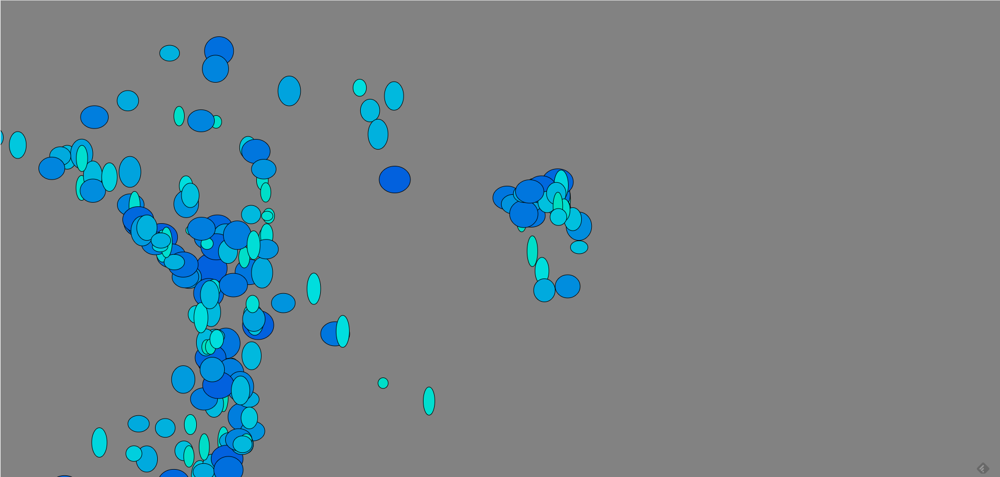

# JS_ART
project 1
---------

  
  

First project "canvas_sketch_1" awating dana review :)
1. npm i
2. run one of the pattens using canvas-sketch
open gitBash and run the command
command1: canvas-sketch pattarn1.js
command2: canvas-sketch pattarn1.js

based on
https://github.com/mattdesl/canvas-sketch

project 2
---------

p5.js based project need to run with a server.
